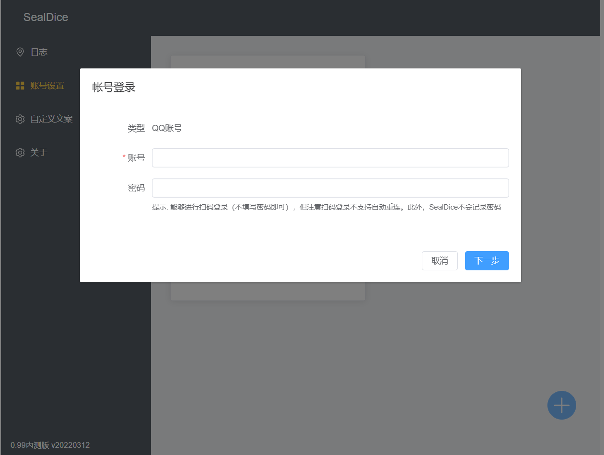
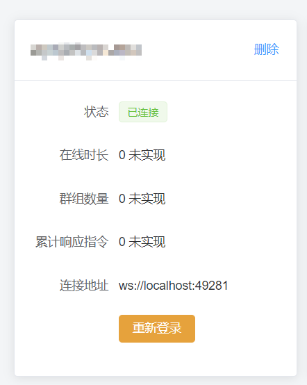
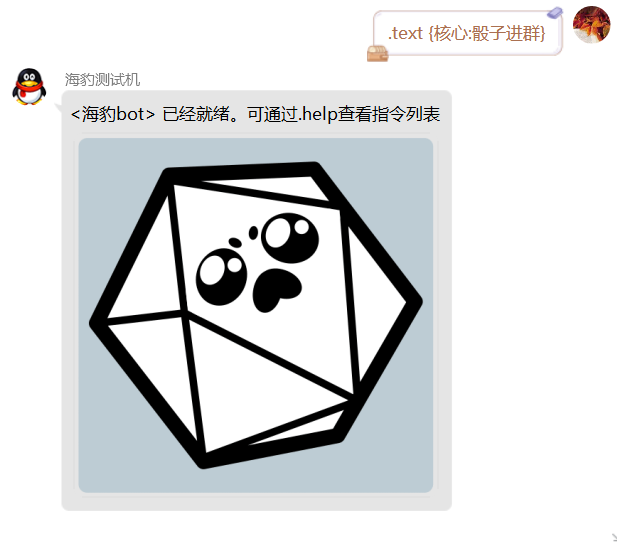
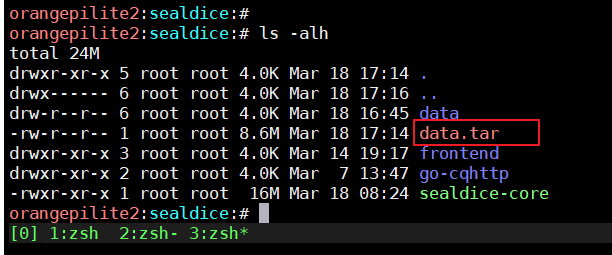

# SealDice: 指令手册


## 概述

一个简单易用的跑团骰子系统。

形象是海豹，可以被叫做**海豹骰、豹骰，豹子骰**之类。


特性：

* 点击运行，一键部署
* 非常友好的界面
* 极低的资源占用，程序包10MB，占用内存约20MB
* 支持Windows/Linux/macOS系统，x64和arm64架构
* 与现有主流骰系极为相似的指令
* Golang编写


目前已经基本实现了主流骰子提供的指令，主要参考`SinaNya(塔系)`、`Dice!(溯回系)`、`ZhaoDice(赵骰)`三系骰子的手册。

能够提供基础的roll点功能、角色管理，以及coc7版规则指令支持。

以及牌堆等娱乐功能。

为了方便使用，默认随项目附带了`go-cqhttp`的二进制文件和许可协议。

本手册适用于0.99.7版本

最后更新: 2022-03-23

手册使用: [CC BY-NC-SA 4.0协议](https://creativecommons.org/licenses/by-nc-sa/4.0/)


## 如何使用

### 下载安装

首先下载对应系统的压缩包，例如我是Windows系统，选择`sealdice-core_0.0.1_windows_amd64.zip`。


解压后的目录是这样：


双击运行`sealdice-core.exe`


### 登录平台账号

如果是windows系统，会弹出一个Web界面，也可以手动访问：

http://localhost:3211/


随后，点击左侧面板的“帐号设置”，再点击右边的蓝色加号添加一个账号：



输入完成后，点击下一步，根据提示照做即可。这里是需要手机QQ扫码：


如果你看到了“已连接”就说明成功了。



如果没来得及扫，也不要慌，点击“重新登录”，或者”删除“后重新添加帐号即可。


如果登录过程出现任何意料之外的结果，请刷新页面，将日志截图，加入企鹅群`524364253`将信息发送给我。


成功了之后就可以进行测试了。

骰子的大部分指令只在群内工作，请把骰子拉进群进行使用。

默认骰子进群时会自动开启并发送问候语，如果没有的话请执行`@骰子 .bot on`试试


### Mac/Linux 部署

特别的，如果你是Linux/Mac系统，需要在终端运行SealDice。

在终端执行前，请先给文件加可执行权限：

```shell
chmox +x ./go-cqhttp/go-cqhttp
chmox +x ./sealdice-core
```

随后运行

```
./sealdice-core
```

即可。余下的流程和Windows版本相同。

如果你使用服务器部署，不能访问http://localhost:3211，那么改为访问 [http://ip地址:3211](http://ip地址:3211)


### 安装为系统服务 / 自启动

如果你使用远程Linux服务器部署，那么随着SSH终端关闭，通常海豹也会一块关闭。

SealDice提供了一种自动安装为系统服务(systemd服务项)的功能，可以免去手动配置：

```shell
./sealdice-core -i
正在安装系统服务，安装完成后，SealDice将自动随系统启动
安装完成，正在启动……
```

卸载：

```
./sealdice-core --uninstall
正在卸载系统服务……
系统服务已删除
```

安装完成后，可以使用systemctl来管理服务:

```
systemctl status seal-dice
systemctl start seal-dice
systemctl stop seal-dice
journalctl -xe -u seal-dice.service // 查看日志
```

更多用法参见`systemd`文档

P.S. 如果你有自己的onebot服务端，请将其设为WS主动连接模式，手动修改`data/default/serve.yaml`即可进行连接。


## 提要

本手册的指令使用这样的格式来进行介绍：

```
.指令 <参数A> <参数B> (参数C)
```

其中，`<>`括起来的内容代表”某个概念“，实际指令不需要加<>

而`()`括号括起来的内容代表这是一个可选参数

以骰点指令举例:

```
.r <表达式> (<原因>)
```

`<表达式>`是必填内容，譬如是d100，原因是可选内容

```
.r d100 高于50就打扫卫生
```

会得到这样的结果：

```
由于高于50就打扫卫生，<木落>掷出了 d100=[1d100=90]=90
```

接下来，本手册的指令示例都将以这种形式书写：

```
.r d100 高于50就打扫卫生  // 这部分是解说，不算在指令里
Dice: 由于高于50就打扫卫生，<木落>掷出了 d100=[1d100=90]=90
```

第一行为指令，第二行Dice:开头的代表骰子的回复，直到末尾。


### 阅览建议

强烈建议在阅读本文档时，展开左侧的目录


## 速通攻略(未完成)

如果你需要以PL身份参团，并快速掌握常用指令，可以遵循此节内容。

或者你是其他骰系的使用者，想要快速过一遍常用指令用法，这篇文档也适用于你。

当前内容以实际跑团过程为蓝本编写，适用于多数团。

#### 

### CoC团玩家

#### 1. 车卡录卡

临时创建人物/天命

```
.coc5

.st 力量70str70敏捷70dex70意志70pow70体质70con70外貌50app50教育70知识70edu70体型70siz70智力70灵感70int70san55san值55理智55理智值55幸运50运气50
```

载卡

```
.ch
```


#### 2. 骰点

```
.r 3d6*5
```


#### 3. 检定

```
.ra 聆听
.ra 幸运70
.ra 3#p射击
```

#### 4. 理智检定、掉血

```
.sc 0/1d4
.st hp-1d4
```


## 核心指令

`核心指令`是无法被关闭的指令。

与之相对的概念是`扩展指令`，扩展指令可以被关闭。

举例来说，输入`.ext coc7 off`关闭coc7扩展，那么相关的指令，例如`.st` `.sc` `.ra` `.setcoc`等就不会响应了。

关于扩展的概念，请阅读下方“扩展”一节


> 特别提醒：
>
> 你可能会觉得指令很复杂，但其实！现在的骰系就是如此。
>
> 如果你很熟悉赵系、溯回系、塔系，特别是前两者，那么90%的内容是一样的！


###  .r 骰点

格式: `.r <表达式> (<原因>)`

别名: `.roll` `.rd`

可用范围: 群内、私聊


#### 常用示例

特别提醒一下，如果不写骰子算符(d/b/p，概念见下)，r指令相当于计算器

```
.r
Dice: <木落>掷出了 D100=69

.r d50
Dice: <木落>掷出了 d50=[1d50=48]=48

.r d50 天气不错
Dice: 由于天气不错，<木落>掷出了 d50=[1d50=4]=4

.r 5d24 骰5个24面骰
Dice: 由于骰5个24面骰，<木落>掷出了 5d24=[5d24=60, 7+20+15+1+17]=60

.r 4d6k3 骰4个6面骰，选3个最大的
Dice: 由于骰4个6面骰，选3个最大的，<木落>掷出了 4d6k3=[{6 5 3 | 1 }]=14

.r 100 + 3 * 2
Dice: <木落>掷出了 100 + 3 * 2=100 + 6=106
```


#### 奖励骰/惩罚骰

一类特殊的骰子，线下游戏时，D100是两个10面骰骰出来的，一个是个位，一个是十位。

如果十位骰为10，个位骰为1-9，那么结果是1-9（十位视为0）

如果两个10面骰都骰到10，那结果就是100

奖惩骰的机制是，多指定数量个十位骰，例如获得2个奖励骰，那么就丢3个十位骰。

假设十位骰结果是{4,5,8}，个位骰结果是2，那么最终结果就是42（取好的结果）

如果是惩罚骰，那么最终结果是82（取坏的结果）

```
.r b
Dice: <木落>掷出了 b=[D100=72, 奖励 4]=42

.r b3
Dice: <木落>掷出了 b3=[D100=96, 奖励 4 6 3]=36

.r p4 惩罚骰
Dice: 由于惩罚骰，<木落>掷出了 p4=[D100=87, 惩罚 5 7 8 7]=87
```


#### 多轮骰点

```
.r 4#d10
Dice:
<木落>掷骰4次:
d10=[1d10=9]=9
d10=[1d10=3]=3
d10=[1d10=7]=7
d10=[1d10=8]=8
```


#### 混合运算

```
.r 30 + (-1d20) + 49
Dice: <木落>掷出了 30 + (-1d20) + 49=30 + -1[1d20=1] + 49=78

.r d50 * 3 + 2
Dice: <木落>掷出了 d50 * 3 + 2=21[1d50=21] * 3 + 2=65

.r d50 * 3 + (2 - p2) 多项式
Dice: 由于多项式，<木落>掷出了 d50 * 3 + (2 - p2)=25[1d50=25] * 3 + -64[D100=6, 惩罚 6 5]=11
```


事实上，SealDice支持了这些算符：

**常用数学算符:** 加减乘除(+-*/)、乘方(**)、括号

**骰子算符:** 多面骰(d, <次数>d<面数>(k<个数>))，奖励骰(b, b<个数>)、惩罚骰(p, p<个数>)


用字母表示的骰子算符有些反直觉，其实它们和加减乘除是一样的：

```
.r 1d1d1d1d1d1d1d1d1d1d1d1d1d1d(20+1d3*4)
Dice: <木落>掷出了 1d1d1d1d1d1d1d1d1d1d1d1d1d1d(20+1d3*4)=13

.r 1d10+(1+32)d(4*6)d20
Dice: <木落>掷出了 1d10+(1+32)d(4*6)d20=1[1d10=1] + 3941[33d24=384,384d20=3941]=3942
```


### .rh 暗骰

格式: `.rh <表达式> (<原因>)`

别名: `.rhd`

可用范围: 群内


这个指令的格式与`.r`完全相同，只不过效果是在群里撂下一句提示，然后把骰点结果私聊发给你。

不过注意！由于企鹅的严打，陌生人私聊极其容易触发风控，所以私聊发送只会发给好友。如果你不是骰子的好友，看不到任何结果。


```
// 群内
.rh d50
Dice: 命运正在低语！

// 私聊
Dice:
来自群<某个无聊团>(123)的暗骰:
<木落>掷出了 d10=[1d10=3]=3
```


### .rx / .rxh 特殊骰点

格式: `.rx <表达式> (<原因>)`

别名: 无

可用范围: 群内、私聊


**这个指令一般跑团可以不用看了。**

它主要和`表达式`是否允许读取变量有关。举个例子：

```
.r 聆听
Dice: 由于聆听，<折影>掷出了 D100=54

.rx 聆听
Dice: <木落>掷出了 聆听=[聆听=60]=60

.rx 聆听+d10
Dice: <木落>掷出了 聆听=[聆听=60] + 8[1d10=8]=68

.rx 侦查+1d20**2
Dice: <木落>掷出了 侦查+1d20**2=75[侦查=75] + 324[1d20=18]=399

.rx d(侦查)
Dice: <木落>掷出了 d(侦查)=[侦查=60,1d60=52]=52
```


### .bot 骰子管理

格式: `.bot on/off/bye/about`

别名: 无

可用范围: 群内、私聊


较为简单的指令，直接看例子：

```
.bot on // 开启
Dice: <海豹bot> 已启用 SealDice 0.99内测版 v20220312

.bot off // 关闭
Dice: <海豹bot> 停止服务

.bot bye // 退群
Dice: 收到指令，5s后将退出当前群组

.bot // 或者 .bot about
Dice: SealDice 0.99内测版 v20220312
供职于8个群，其中3个处于开启状态
上次自动保存时间: 2022-03-13 04:57:55 UTC
群内工作状态: 开启
```


### .nn 角色名设定

格式: `.nn (<角色名>)`

别名: 无

可用范围: 群内


若有角色名参数，则进行设定。若无角色名，重置回默认名字。

```
.nn 简·拉基·茨德
Dice: <木落>()的昵称被设定为<简·拉基·茨德>

.r
Dice: <简·拉基·茨德>掷出了 D100=16

.nn
Dice: <木落>(303451945)的昵称已重置为<木落>
```


### .set 设定骰子面数

格式: `.set` // 查看当前面数设置

格式: `.set <面数>` // 设定群内骰子面数

格式: `.set <面数> --my` // 设定个人专属骰子面数

格式: `.set clr` // 清除群内骰子面数设置

格式: `.set clr --my` // 清除个人骰子面数设置

别名: 无

可用范围: 群内、私聊


```
.set 20
Dice: 设定默认骰子面数为 20

.set
个人骰子面数: 0
群组骰子面数: 20
当前骰子面数: 20
```


设定骰子面数，默认值是100

优先级: **个人 > 群 > 默认(100)**


### .ch 角色卡管理

格式: `.ch save/load/list/del`

别名: `.pc` `.角色`

可用范围: 群内


.ch save (<角色名>) // 保存角色，角色名省略则为当前昵称

.ch load (<角色名>) // 加载角色，角色名省略则为当前昵称

.ch list // 列出当前角色

.ch del <角色名> // 删除角色

.ch help 显示帮助


### .help 帮助指令

格式: `.help (<词条名>)`

别名: 无

可用范围: 群内、私聊


设定自己的默认骰子面数，默认是D100

如果什么都不写，直接`.set`会将面数重置为默认值

只在群内有效，且只对自己有效。


### .ext 扩展管理

格式: `.ext <扩展名> on/off`  //开关

格式: `.ext <扩展名>` // 查看信息

格式:`.ext list`  // 查看扩展列表

可用范围: 群内


SealDice 除了核心模块之外，都被设计为可插拔的，目前有5个内置扩展。

关闭对应扩展会连同扩展带来的指令一块关闭。

注意！每个群可以分别开启不同的扩展。

```
.ext
Dice:
检测到以下扩展：
1. [开]coc7 - 版本:1.0.0 作者:木落
2. [开]log - 版本:1.0.0 作者:木落
3. [开]fun - 版本:1.0.0 作者:木落
4. [开]deck - 版本:1.0.0 作者:木落
5. [关]reply - 版本:1.0.0 作者:木落
使用命令: .ext <扩展名> on/off 可以在当前群开启或关闭某扩展。
命令: .ext <扩展名> 可以查看扩展介绍及帮助


.ext coc7 on
Dice: 打开扩展 coc7

.ext reply
Dice:
> [reply] 版本1.0.0 作者木落
> [尚未实现]智能回复模块，支持关键字精确匹配和模糊匹配
提供命令:
.reply


.ext reply off
Dice: 关闭扩展 reply
```

开启或关闭扩展能够直接改变骰子响应的命令。

例如coc7扩展提供了`.coc` /`.st` / `.ra` / `.rc` / `.sc` / `.setcoc` / `.ti` / `.li`一系列指令。

扩展关闭后，这些指令也会失效，可以有效避免指令混淆（**每个群都可以启用不同的扩展**）

例如我在A群打开`coc7`和`deck`两个扩展，B群可以只开启`deck`扩展，等等。

未来将制作更多官方扩展，以及提供自定义扩展脚本接口。


### .text 自定义文本命令 

格式: `.text <文本表达式>`

别名: 无

可用范围: 群内、私聊


这个命令的使用方式很简单：

```
.text Hello World!
Dice: Hello World!
```

它支持变量，比如有一些内置变量（角色属性也是变量）：

```
.text Hello {$t玩家}，你的理智属性为{san}
Dice: Hello <木落>，你的理智属性为50
```

还可以做赋值操作，例如

```
.text 你直面了未知。扣除理智{$tSan=1d10}，理智变化: {san} ➯ {san=san-$tSan}
Dice: 你直面了未知。扣除理智5，理智变化: 50 ➯ 45
```

一个较为复杂的例子，coc7角色做成：

```
.text 力量:{$t1=3d6*5} 敏捷:{$t2=3d6*5} 意志:{$t3=3d6*5} 体质:{$t4=3d6*5} 外貌:{$t5=3d6*5} 教育:{$t6=(2d6+6)*5} 体型:{$t7=(2d6+6)*5} 智力:{$t8=(2d6+6)*5} 幸运:{$t9=3d6*5} 生命值:{($t4+$t7)/10} 总数:{$t1+$t2+$t3+$t4+$t5+$t6+$t7+$t8}
Dice: 力量:40 敏捷:65 意志:60 体质:55 外貌:30 教育:65 体型:50 智力:40 幸运:30 生命值:10 总数:405
注: .coc命令内部也是如此实现
```

你可能注意到了有的变量带`$t`前缀，这是“临时变量”的意思。

想了解更多关于变量，见“变量机制”一节


## 扩展: coc7


### .coc 制卡指令

格式: `.coc (<数量>)` // 制卡指令，返回<数量>组人物属性

别名: 无

可用范围: 群内、私聊


```
.coc 3
Dice:
<木落>的七版COC人物作成:
力量:40 敏捷:80 意志:30
体质:80 外貌:50 教育:45
体型:55 智力:60
HP:13 幸运:50 [440/490]

力量:55 敏捷:75 意志:45
体质:30 外貌:65 教育:60
体型:65 智力:50
HP:9 幸运:25 [445/470]

力量:45 敏捷:55 意志:50
体质:55 外貌:60 教育:85
体型:50 智力:55
HP:10 幸运:60 [455/515]
```


### .en 技能成长

格式: `.en <技能名称>(技能点数) (+(<失败成长值>/)<成功成长值>)` // 整体格式，可以直接看下面几个分解格式

格式: `.en <技能名称>` // 骰D100，若点数大于当前值，属性成长1d10

格式: `.en <技能名称>(技能点数)` // 骰D100，若点数大于`技能点数`，属性=技能点数+1d10

格式: `.en <技能名称>(技能点数) +<成功成长值>` // 骰D100，若点数大于当前值，属性成长`成功成长值`点

格式: `.en <技能名称>(技能点数) +<失败成长值>/<成功成长值>` // 骰D100，若点数大于当前值，属性成长`成功成长值`点，否则增加`失败成长值`点

别名: 无

可用范围: 群内

```
.en 侦查
Dice:
<木落>的“侦查”成长检定：
D100=68/66 成功
“侦查”增加了1d10=3点，当前为69点
角色信息已经变更，别忘了使用.ch save来进行保存！

// 以下例子省略掉骰子的回复
.en 侦查30
.en 侦查 +1d20 // 若成功，成长1d20
.en 侦查 +1d5/1d10

.en 侦查 +-1d5/1d10
.en 侦查 +(-1d5)/1d10 // 跟上一句相同，带括号容易理解一点
```


### .st 属性设置

格式: `.st`

别名: 无

可用范围: 群内


.st show/list <数值> // 展示个人属性，若加<数值>则不显示小于该数值的属性，防止刷屏
.st clr/clear // 清除属性
.st del <属性名1> <属性名2> ... // 删除属性，可多项，以空格间隔
.st help // 帮助
.st <属性名><值> // 例：.st 敏捷50，可多项，如 .st 敏捷50力量60
.st <属性名>±<表达式> // 例：.st 敏捷+1d50


### .ra/rc 技能检定

格式: `.ra/rc <属性表达式> (@某人)`

格式: `.ra <难度><属性> (@某人)` // 如 .ra 困难侦查

格式: `.ra b <属性表达式> (@某人)` // 奖励骰或惩罚骰

格式: `.ra p <属性表达式> (@某人)` // 奖励骰或惩罚骰

格式: `.ra b<数字或括号> <属性表达式> (@某人)`

别名: 无

可用范围: 群内


属性检定指令，当<检定表达式>算出的值小于<属性表达式>，如计算 D100 < 聆听，

若小于，则检定通过。当@某人时对此人做检定。

rc是规则书检定。而ra是房规检定。

区别主要在于对大成功/大失败的判定方式。

当`.setcoc 0`时，ra和rc等价。

可以使用类似多轮骰点的多轮检定。


#### 举例

```
.ra 聆听
Dice: <木落>的聆听检定结果为: d100=59/76, ([1d100=59]) 成功

.ra 困难侦查
Dice: <折影>的困难侦查检定结果为: D100=7/12 成功了！这要费点力气

.ra b 射击
Dice: <木落>的射击检定结果为: b=60/60, ([D100=60, 奖励 0]) 成功

.ra 3# b 射击
Dice: 
<木落>的射击进行了3次检定，结果为:
b=17/60, ([D100=17, 奖励 1]) 成功(极难)
b=32/60, ([D100=92, 奖励 3]) 成功
b=49/60, ([D100=49, 奖励 6]) 成功

// 其实指令可以连写，不过不是很建议，例如这样的写法(溯洄骰)
.ra3#b射击
// 也支持这样的写法(赵骰)
.rab3#射击

他们都与上面的写法等价
```


#### 对别人做检定

如果kp/dm希望对某人做检定，可以检定时@对方，同时适用于暗中检定。

```
.ra 侦查 @猛男
Dice: <猛男>的侦查检定结果为: d100=95/55, ([1d100=95]) 失败！

.ra 侦查 // 不@是自己
Dice: <木落>的侦查检定结果为: d100=48/88, ([1d100=48]) 成功
```


### .rah/rch 暗中检定

格式: `.rch/rah (<检定表达式，默认d100>) <属性表达式> (@某人)`

别名: 无

可用范围: 群内


与.ra/.rc完全相同，只不过会将结果私聊发送


### .sc 理智检定

格式: `.sc (<成功时掉san>/<失败时掉san>)`

别名: 无

可用范围: 群内


对理智进行一次D100检定，根据结果扣除理智。

如“.sc 0/1d3”为成功不扣除理智，失败扣除1d3。大失败时按掷骰最大值扣除。

支持复杂表达式。如.sc 1d2+3/1d(知识+1)

大成功/大失败判定遵循房规。


### .setcoc 设置房规

格式: `.setcoc 0-5`

别名: 无

可用范围: 群内


| 序号    | 规则                                                         |
| ------- | ------------------------------------------------------------ |
| 0[默认] | 出1大成功，不满50出96-100大失败，满50出100大失败(COC7规则书) |
| 1       | 不满50出1大成功，不满50出96-100大失败，满50出100大失败       |
| 2[常用] | 出1-5且判定成功为大成功，出96-100且判定失败为大失败          |
| 3       | 出1-5大成功，出96-100大失败(即大成功/大失败时无视判定结果)   |
| 4       | 出1-5且≤(成功率/10)为大成功，不满50出>=96+(成功率/10)为大失败，满50出100大失败 |
| 5       | 出1-2且≤(成功率/5)为大成功，不满50出96-100大失败，满50出99-100大失败 |


### .ti 抽取临时性疯狂症状

格式: `.ti`

别名: 无

可用范围: 群内

```
.ti
<木落>的疯狂发作-即时症状:
1D10=8
竭嘶底里：调查员表现出大笑，哭泣，嘶吼，害怕等的极端情绪表现，持续 1D10=10 轮。
```


### .li 抽取总结性疯狂症状

格式: `.li`

别名: 无

可用范围: 群内

```
.li
<木落>的疯狂发作-总结症状:
1D10=8
逃避行为：调查员恢复清醒时发现自己在很远的地方，也许迷失在荒郊野岭，或是在驶向远方的列车或长途汽车上。
```


## 扩展: dnd5e

注: dnd5e指令暂时无法在私聊中使用。这是因为扩展指令`.ext`暂时不能在私聊中使用，所以无法在私聊中开启dnd5e扩展。


### .dnd 制卡指令

格式: `.dnd (<数量>)` // 制卡指令，返回<数量>组人物属性，最高为10次

别名: 无

可用范围: 群内、私聊


```
.coc 5
Dice:
<木落>的七版COC人物作成:
力量:75 敏捷:85 意志:35 体质:50 外貌:50 教育:75 体型:60 智力:60 幸运:60 生命值:11 总数:490/550
力量:55 敏捷:70 意志:45 体质:50 外貌:55 教育:75 体型:70 智力:55 幸运:50 生命值:12 总数:475/525
力量:75 敏捷:65 意志:55 体质:30 外貌:65 教育:65 体型:70 智力:60 幸运:40 生命值:10 总数:485/525
力量:65 敏捷:35 意志:40 体质:45 外貌:75 教育:60 体型:70 智力:75 幸运:40 生命值:11 总数:465/505
力量:50 敏捷:45 意志:65 体质:40 外貌:50 教育:60 体型:60 智力:65 幸运:35 生命值:10 总数:435/470
```


### .ri 先攻

格式: `.ri <先攻值> <角色名>` // 角色名省略为当前角色

格式: `.ri +2 <角色名>` // 先攻值格式1，解析为D20+2

格式: `.ri =D20+3 <角色名>` // 先攻值格式2，解析为D20+3

格式: `.ri 12 <角色名>` // 先攻值格式3，解析为12

格式: `.ri <单项>, <单项>, ...` // 允许连写，逗号分隔

别名: 无

可用范围: 群内


先攻

```
// 单独设置
.ri +2 // 为自己设定
.ri +3 狗头人1 // D20加值方式
.ri =D20+2 狗头人1 // 表达式方式
.ri 30 狗头人1  // 数值方式


// 批量设置
.ri +2 狗头人1, 3 狗头人2, =d30 狗头人3 +3
Dice:
先攻点数设置: 
 1. 狗头人1: 10[1d20=10] + 2=12
 2. 狗头人2: 3
 3. 狗头人3: 1
 4. 木落: 1[1d20=1] + 3=4

```


### .init 先攻列表

格式: `.init` // 查看先攻列表

格式: `.init del <单位1> <单位2> ...` // 从先攻列表中删除

格式: `.init set <单位名称> <先攻表达式>` // 设置单位的先攻

格式: `.init clr` // 清除先攻列表

格式: `.init help` // 显示本帮助

别名: 无

可用范围: 群内


```
// 设置先攻
.ri +2 狗头人1, 4 狗头人2, 12 木落
Dice:
先攻点数设置: 
 1. 狗头人1: 8[1d20=8] + 2=10
 2. 狗头人2: 4
 3. 木落: 12

// 查看列表
.init
Dice:
当前先攻列表为:
 1. 木落: 12
 2. 狗头人2: 10
 3. 狗头人1: 4
```


## 扩展: 日志

.log new 新建日志并开始记录
.log on 开始记录
.log off 暂停记录
.log end 完成记录并发送日志文件


## 扩展: 娱乐

### .jrrp 今日人品

格式: `.jrrp`

别名: 无

可用范围: 群内、私聊

```
.jrrp
Dice: <折影>的今日人品为68
```


### .gugu 人工智能鸽子

格式: `.gugu`

别名: `.咕咕`

可用范围: 群内、私聊

```
.gugu
Dice: 🕊️:今天发版本，领导说发不完不让走
```

P.S. 灵感来自于[狗头人网站](http://www.koboldgame.com/)的同名功能，测试版本中有部分语料来自此网站，但是由于一直联系不上网站作者，无法拿到授权，所以在正式版本时将会全部替换。


## 扩展: 牌堆

抽牌命令: 
.deck help // 显示本帮助
.deck list // 查看载入的牌堆文件
.deck keys // 查看可抽取的牌组列表
.deck search <牌组名称> // 搜索相关牌组
.deck <牌组名称> // 进行抽牌


## 扩展: 智能回复

支持关键字匹配和模糊匹配

开发中……


## 骰子自定义

SealDice可以对骰子进行几乎完全的自定义，绝大部分指令的文本都可以进行修改。

同时还支持插入图片和CQ码。


### 界面概览

一图胜千言：


这是SealDice的自定义文案界面，左侧是分类：


右侧是具体的文本，我们以“大成功”文本来举例：


这里有两行文本，骰子会随机抽取其中的一行文本来使用。例如：

```
.ra 力量
Dice: <木落>的力量检定结果为:D100=3/30=([1d100=3]) 大成功!

.ra 力量
Dice: <木落>的力量检定结果为:D100=2/30=([1d100=3]) 运气不错，大成功！11111
```

如果想要添加一行，那么点击左侧加号按钮：


如果你觉得某一行不满意，点左侧删除按钮。


最后，如果你想回到初始设置，点击右上角的刷子图标。


随后会弹出确认框，点击确定后，一切就是刚开始的样子了。


此时，刷子图标也会消失。

当然，修改好之后，不要忘记保存！！**注意保存前不要切换左侧的分类！**


### 插入图片和CQ码

将图片放在骰子的适当目录（建议放在data/images），再写这样一句话即可:

**[图:data/images/sealdice.png]**

例如骰子进群的文本：


全文本为：

```
<{核心:骰子名字}> 已经就绪。可通过.help查看指令列表\n[图:data/images/sealdice.png]
```

效果如下：



### 变量标签

你可能注意到，有些词条下面有这样的内容：


文本下方的标签代表了被默认文本所使用的特殊变量，你可以使用 {变量名} 来插入他们，例如 `{$t判定值}`

除此之外，有些变量可以在所有文本中使用，具体列表可以见下方“变量机制”一节。


以及，所有的自定义文本都可以嵌套使用，例如：

```
这里是{核心:骰子名字}，我是一个示例
```

默认会被解析为:

``````
这里是海豹，我是一个示例
``````

注意！千万不要递归嵌套，会发生很糟糕的事情


## 辅助机制


### 属性同义词

例如在COC录卡的时候，有这样的指令:

```
.st 力量50str50
Dice: <木落>的属性录入完成，本次共记录了2条数据 (其中1条为同义词)
```

很显然`力量`和`str`是同一个属性，所以只会录入一条属性。

```
.st show
Dice: <木落>的个人属性为：力量: 50
```

同理，在`.ra`判定以及其他场景中，`力量`和`str`也一样会当作同一个值处理


同义词表遵循以下原则:

- 中文和英文缩写等价，如`力量`和`str`
- 同一概念的不同常用称呼，如`san` `san值` `理智` `理智值`
- 易混词汇，如`侦查` `侦察`
- COC6版和7版翻译区别，如`话术` `快速交谈`
- 简繁区别，如`体质` `體質`
- *少量游戏性等值属性，如`枪械` `射击`，`智力` `灵感`，`教育` `知识`


具体内容如下:

```typescript
{
    "理智": {"san", "san值", "理智值", "理智点数", "心智", "心智点数", "心智點數", "理智點數"},
    "力量": {"str"},
    "体质": {"con", "體質"},
    "体型": {"siz", "體型"},
    "敏捷": {"dex"},
    "外貌": {"app"},
    "意志": {"pow"},
    "教育": {"edu", "知识", "知識"}, // 教育和知识等值而不是一回事，注意
    "智力": {"int", "灵感", "靈感"}, // 智力和灵感等值而不是一回事，注意

    "幸运":    {"luck", "幸运值", "幸運", "幸運值"},
    "生命值":   {"hp", "生命", "血量", "耐久值"},
    "魔法值":   {"mp", "魔法", "魔力", "魔力值"},
    "克苏鲁神话": {"cm", "克苏鲁", "克蘇魯", "克蘇魯神話"},
    "图书馆使用": {"图书馆", "图书馆利用", "圖書館", "圖書館利用"},
    "计算机使用": {"电脑使用", "計算機使用", "電腦使用", "计算机", "电脑", "計算機", "電腦"},
    "电气维修":  {"电器维修", "電氣維修", "電器維修"},
    "话术":    {"快速交谈", "話術", "快速交談"},
    "锁匠":    {"钳工", "鎖匠", "鉗工"},
    "机械维修":  {"机器维修", "機器維修"},
    "精神分析":  {"心理分析"},
    "追踪":    {"跟踪", "追蹤", "跟蹤"},
    "地质学":   {"地理学", "地質學", "地理學"},
    "链枷":    {"连枷", "連枷", "鏈枷"},
    "信用评级":  {"信誉", "信用", "信誉度", "信用評級", "信譽", "信譽度"},
    "护甲":    {"装甲", "護甲", "裝甲"},
    "枪械":    {"火器", "射击", "槍械", "射擊"},
}
```

同义词列表可以在骰子运行后，查看骰子目录下`data/default/extensions/coc7/attribute.yaml`

目前不可自定义。


### 变量机制

你可能注意到，这里出现了一些`san` 、`$t玩家`之类的东西，这些是SealDice中的**变量**。

内置变量有：

| 变量名         | 示例结果             |
| -------------- | -------------------- |
| $t玩家         | <木落的角色>         |
| $tQQ昵称       | <木落>               |
| $t个人骰子面数 | 100                  |
| $tQQ           | 123456789            |
| 常量:APPNAME   | SealDice             |
| 常量:VERSION   | 0.91测试版 v20220228 |
| *娱乐:今日人品 | <木落>的今日人品为12 |

变量的名称可以是汉字、字母和数字，`$t`是一个特殊的变量前缀

*注: 所有自定义文案均为可用变量

| 变量名字 | 用途                     | 举例             |
| -------- | ------------------------ | ---------------- |
| 普通名字 | 玩家的角色属性           | 理智、力量、智力 |
| $t开头   | 个人临时变量，不存数据库 | $t随机点数       |
| $m开头   | 个人变量，跨群存在       | $m今日人品       |
| $g开头   | 群变量，群内所有人共享   | $g群主体重       |

所有变量均可以在`.rx` / `.rxh` / `.ra`/`.text`等指令中、以及在自定义文案(`text-template.yaml`)中使用

#### 附录：常用变量名表

$t判定结果 // 大成功 成功 失败
$t判定值
$t增量
$t新值
$t旧值
$t变化量
$t表达式文本
$t数量
$t失败数量
$t成功数量
$t属性
$t结果文本
$t计算过程


## 服务器管理

### Windows间迁移

来到海豹目录，右键添加为压缩包，带走。


### Windows往Linux迁移

来到海豹目录，右键data文件夹，添加为zip压缩包。

到Linux服务器上事先准备好的海豹程序文件夹，执行:

```shell
unzip ./data.zip
```

将其解压，然后运行海豹核心

```
./sealdice-core
```


#### Linux服务器间跨平台迁移(arm64->amd64)

首先在你的旧服务器上，关闭海豹进程，随后来到海豹的工作目录，执行

```
tar -zcvf ./data.tar ./data
```

将data目录打包。




现在你多拥有了一个data.tar，复制到新的服务器，预先准备好的海豹程序目录，执行这条命令解压:

```
tar --no-same-owner -zxvf data.tar
```

然后启动海豹即可。

```
./sealdice-core
```

如果文件权限不正确，可以在目录下执行这两条:

```
find . -type f | xargs chmod 644
find . -type d | xargs chmod 755
```


## 特色功能(未完成)

-


## 免责声明

兴趣使然之作。

使用造成的任何后果与本人无关。

进行使用即代表同意此声明。


## 联系方式

### 海洋馆工作人员:

木落 (fy0748#gmail.com)

Yumeno(184023393)

鹊鹊(1251343516)


### 作者Github

https://github.com/fy0


### 官方站点

http://sealdice.com/

建设中，预计提供log染色、人物卡制作、新版本发布、云人物卡、自动更新等功能。


### 投喂

Comming Soon

1.0之后再说


### 测试群


